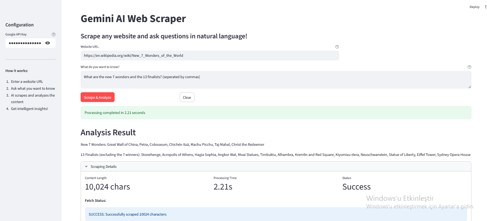

# AI Web Scraper

A Streamlit-based web application that combines web scraping with Google's Gemini AI to intelligently extract and analyze webpage content using natural language queries.

## Features

- **Smart Web Scraping**: Extracts clean content from any website
- **AI-Powered Analysis**: Uses Google Gemini to answer specific questions about scraped content
- **Interactive UI**: Clean Streamlit interface for easy use
- **Robust Error Handling**: Handles network errors, parsing issues, and API failures gracefully
- **Content Optimization**: Automatically cleans and truncates content for optimal AI processing

## Demo



## Prerequisites

- Python 3.8 or higher
- Google AI Studio API key

## Installation

1. Clone this repository:
```bash
git clone https://github.com/quddusi-t/web-scraping-mastery.git
cd web-scraping-mastery/ai-web-scraper
```

2. Install dependencies:
```bash
pip install -r requirements.txt
```

3. Set up environment variables:
```bash
# Create .env file
echo "GOOGLE_API_KEY=your_api_key_here" > .env
```

## Usage

1. Start the Streamlit application:
```bash
streamlit run app.py
```

2. Open your browser and navigate to the provided URL (typically `http://localhost:8501`)

3. Enter a website URL and ask questions in natural language:
   - "Summarize the main points"
   - "Extract all contact information" 
   - "Find pricing details"
   - "List all product features"

## How It Works

1. **Web Scraping**: Uses `requests` and `BeautifulSoup` to fetch and parse HTML content
2. **Content Processing**: Removes unnecessary elements (scripts, styles, navigation) and cleans text
3. **AI Analysis**: Sends processed content to Google Gemini with user's question
4. **Results Display**: Shows both the AI analysis and raw scraping details

## Technical Details

### Architecture
- **Frontend**: Streamlit for web interface
- **Web Scraping**: requests + BeautifulSoup4
- **AI Integration**: LangChain + Google Generative AI
- **Content Processing**: Custom text cleaning and truncation

### Key Components
- `GeminiWebScraper`: Main scraper class with methods for fetching and analyzing
- `fetch_webpage()`: Handles HTTP requests and HTML parsing
- `analyze_content()`: Interfaces with Gemini AI for content analysis
- `scrape_and_analyze()`: Complete pipeline orchestration

### Error Handling
- Network timeout protection
- Invalid URL handling
- Content size limits for API compatibility
- Graceful degradation when AI analysis fails

## Configuration

### Environment Variables
- `GOOGLE_API_KEY`: Your Google AI Studio API key (required)

### Customizable Settings
- Request timeout: Currently set to 10 seconds
- Content limit: 10,000 characters max
- AI model: Uses `gemini-1.5-flash`

## Limitations

- Requires internet connection
- Subject to website's robots.txt and terms of service
- Limited to static HTML content (no JavaScript rendering)
- API rate limits apply based on Google AI Studio tier

## Contributing

1. Fork the repository
2. Create a feature branch (`git checkout -b feature/amazing-feature`)
3. Commit your changes (`git commit -m 'Add amazing feature'`)
4. Push to the branch (`git push origin feature/amazing-feature`)
5. Open a Pull Request


## Acknowledgments

- Google AI Studio for Gemini API
- Streamlit for the web framework
- BeautifulSoup4 for HTML parsing
- LangChain for AI integration abstractions

## Support

If you encounter issues:
1. Check that your API key is correctly set
2. Verify the target website is accessible
3. Review the console logs for detailed error messages
4. Open an issue on GitHub with reproduction steps